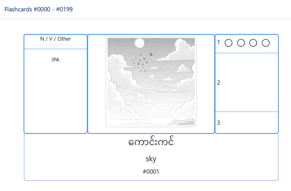

# SEA Flash

Utility to generate flashcards for analysis of SE Asia languages

Outputs to HTML which can then be printed to PDF.

Sample Flashcard for "Sky"



## Configuration File

**Required**

config.json file in the same directory. This handles configuration for generating flashcards. Sample config.json file with Windows pathing:

```json
{
  "lwc" : "Burmese",
  "wordlist": "C:\\src\\sea-flash\\EFEO-CNRS-SOAS Word List.tsv",
  "images" : {
    "directory": "./images",
    "defaultSize": [240, 240]
  },
  "startUID": 1,
  "endUID": 50,
  "cardsPerAccordion": 200
}
```

### config.json fields

The config.json file should have the following fields:

`lwc` **Required** 

: Language name in the wordlist to use for LWC (language of wider communication) fields in the flashcards

`wordlist` **Required** 

: [path to SEA wordlist, which is tab-separated values]

`images` **Required** 

: Object containing the following info:

`directory` **Required**

: [path to images folder]

Images follow the naming convention of bw (black/white) or c (color) followed by 4-digit UID number.

Can be .jpg or .png

For example: *bw0001.jpg* corresponds a black&white image for word of UID 1

Recommend using a directory of freely distributable images from [The Art of Reading](https://bloomlibrary.org/page/resources/art-of-reading) 
under the Creative Commons license.

`defaultSize` **Required** 

: Default image pixel sizes in the flash cards (width, height)

`startUID` *Optional*

: Optional start UID for generating flashcards. If not given, will be 1.

`endUID` *Optional*

: Optional end UID for last flashcard. If not given, will be something like 50.

`cardsPerAccordion` *Optional*

: Optional number of flashcards to orgranize by accordion group. The accordion group defaults to collapsed, and can be expanded. If not given, will be 250. This cannot be larger than `endUID`.

## Pre-requisites and Usage

Install the current LTS of [nodejs](https://nodejs.org/).

Install the dependencies with
```bash
npm install
```

Compile the project with
```bash
npm run build
```

Run the project with
```bash
node dist/index.js
```

This will generate an "[*lwc*] flashcards.htm" file which Google Chrome can then print to PDF.
